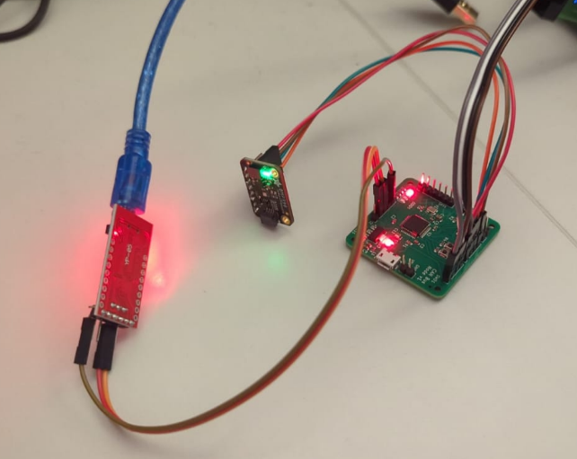

# BMP390 DMA example

Peripheral-to-memory DMA transfer of pressure/temperature values from BMP390 sensor to STM32F103C8T6

Uses my custom "CAN node" STM32 dev board.




```
=====================================
          STM32 BMP390 DMA DEMO
               Tom Danvers
=====================================
BMP390_Init: Checking if device is ready for I2C communications
BMP390_Init: Device is ready for I2C communications
BMP390_Init: chip ID is OK
BMP390_Init: Soft reset command issued
BMP390_Init: EVENT register indicates good soft reset
BMP390_Init: OSR settings updated
BMP390_Init: IIR settings updated
BMP390_Init: ODR settings updated (3)
PWR_CTRL: 0x00, OSR: 0x0C, CONFIG: 0x08, ODR: 0x03
BMP390_Init: Power mode updated to Normal Mode
BMP390_Init: Finished
Starting DMA request
DMA request sent
Pressure: 101650, Temperature: 23
Starting DMA request
DMA request sent
Pressure: 101647, Temperature: 23
Starting DMA request
DMA request sent
Pressure: 101645, Temperature: 23
Starting DMA request
DMA request sent
Pressure: 101643, Temperature: 23
Starting DMA request
DMA request sent
Pressure: 101642, Temperature: 23
```